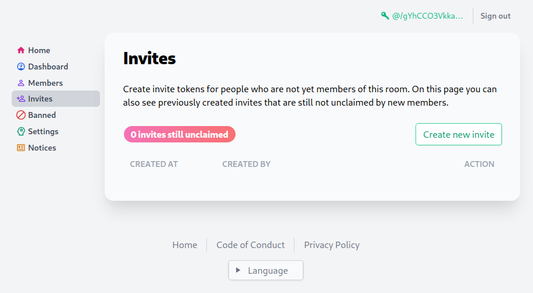

<!--
SPDX-FileCopyrightText: 2021 The NGI Pointer Secure-Scuttlebutt Team of 2020/2021

SPDX-License-Identifier: CC0-1.0
-->

# Go-SSB Room

This repository implements the [Room (v1+v2) server spec](https://github.com/ssbc/rooms2), in Go.

It includes:
* secret-handshake+boxstream network transport, sometimes referred to as SHS, using [secretstream](https://github.com/cryptoscope/secretstream)
* muxrpc handlers for tunneling connections
* a fully embedded HTTP server & HTML frontend, for administering the room

## :star: Features

* Rooms v1 (`tunnel.connect`, `tunnel.endpoints`, etc.)
* User management (allow- & denylisting + moderator & administrator roles), all administered via the web dashboard
* Multiple [privacy modes](https://ssbc.github.io/rooms2/#privacy-modes)
* [Sign-in with SSB](https://ssbc.github.io/ssb-http-auth-spec/)
* [HTTP Invites](https://github.com/ssbc/ssb-http-invite-spec)
* Alias management

For a comprehensive introduction to rooms 2.0, 🎥 [watch this video](https://www.youtube.com/watch?v=W5p0y_MWwDE).

## :rocket: Deployment

If you want to deploy a room server yourself, follow our [deployment.md](./docs/deployment.md) docs.

## :wrench: Development

For an in-depth codebase walkthrough, see the [development.md](./docs/development.md) file in the `docs` folder of this repository.

## :people_holding_hands: Authors

* [cryptix](https://github.com/cryptix) (`@p13zSAiOpguI9nsawkGijsnMfWmFd5rlUNpzekEE+vI=.ed25519`)
* [staltz](https://github.com/staltz)
* [cblgh](https://github.com/cblgh)

## License

MIT

