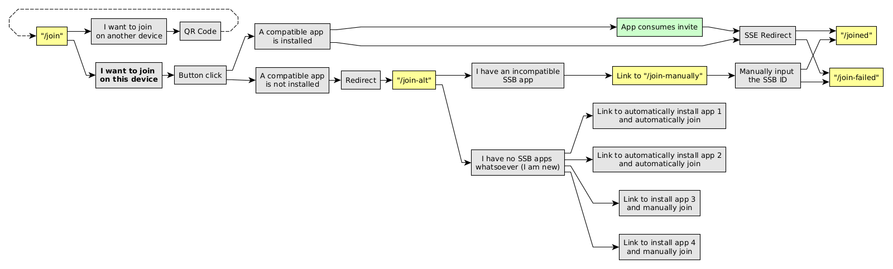

# Architecture

## Invite flow

This implementation of Rooms 2.0 is compliant with the [Rooms 2.0 specification](https://github.com/ssb-ngi-pointer/rooms2), but we add a few additional features and pages in order to improve user experience when their SSB app does not support [SSB URIs](https://github.com/ssb-ngi-pointer/ssb-uri-spec).

A summary can be seen in the following chart:

When the browser and operating system detects no support for opening SSB URIs, we redirect to a fallback page which presents the user with two broad options: (1) install an SSB app that supports SSB URIs, (2) link to another page where the user can manually input the user's SSB ID in a form.

## Sign-in flow

This implementation is compliant with [SSB HTTP Authentication](https://github.com/ssb-ngi-pointer/ssb-http-auth-spec), but we add a few additional features and pages in order to improve user experience. For instance, besides conventional SSB HTTP Auth, we also render a QR code to sign-in with a remote SSB app (an SSB identity not on the device that has the browser open). We also support sign-in with username/password, what we call "fallback authentication".

A summary can be seen in the following chart:

# HTTP Hosting

We currently assume a standard HTTPS server in front of go-ssb-room to facilitate TLS termination and certificate management. This should be possible with most modern HTTP servers since it's a pretty standard practice, known as [reverse proxying](https://en.wikipedia.org/wiki/Reverse_proxy).

Two bits of rational:

1) People usually want to have more then one site on their server. Put differently we could have LetsEncrypt inside the go-ssb-room server but it would have to listen on port :443, blocking the use of other domains on the same IP.
2) Listening on :443 can be pretty annoying (you might need root priviliges or similar capabilities).

go-ssb-room needs three headers to function properly, which need to be forwarded by the webserver.

* `X-Forwarded-Host` as which domain name the room is running (enforce strict TLS checking)
* `X-Forwarded-Proto` to ensure that TLS is used (and redirect if necessary)
* `X-Forwarded-For` the remote TCP/IP address of the client accessing the room (used for rate limiting)

[nginx-example.conf](./nginx-example.conf) contains an [nginx](https://nginx.org) config that we use for `hermies.club`. To get a wildcard TLS certificate you can follow the steps in [this](https://medium.com/@alitou/getting-a-wildcard-ssl-certificate-using-certbot-and-deploy-on-nginx-15b8ffa34157) article which uses the [certbot](https://certbot.eff.org/) utility.